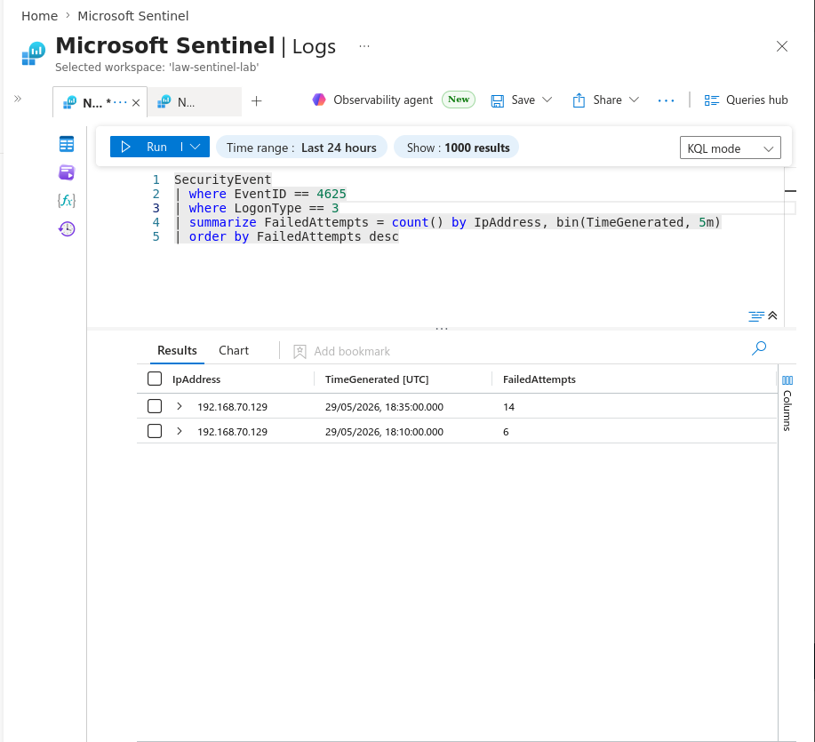
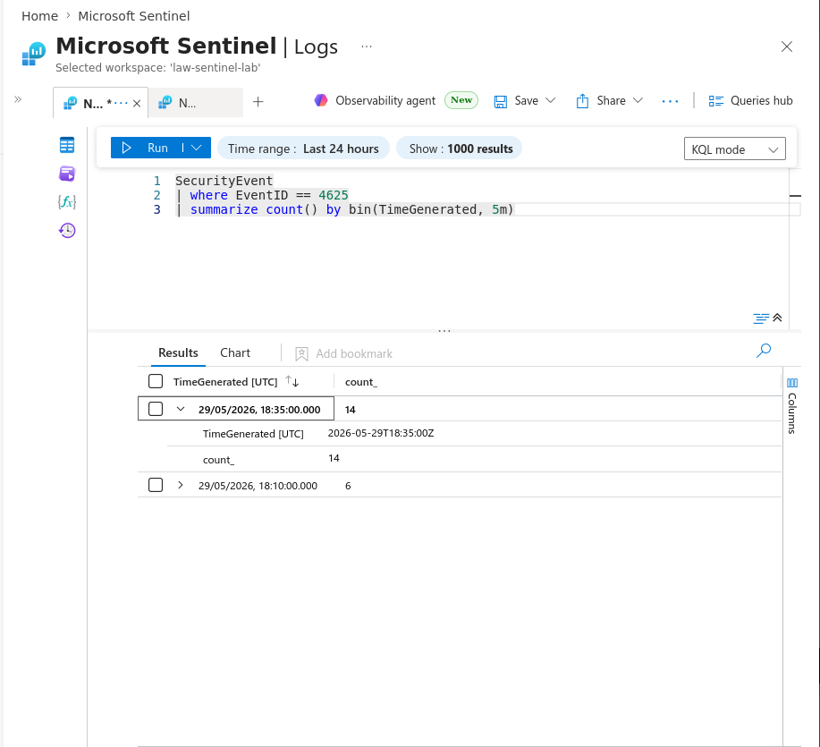
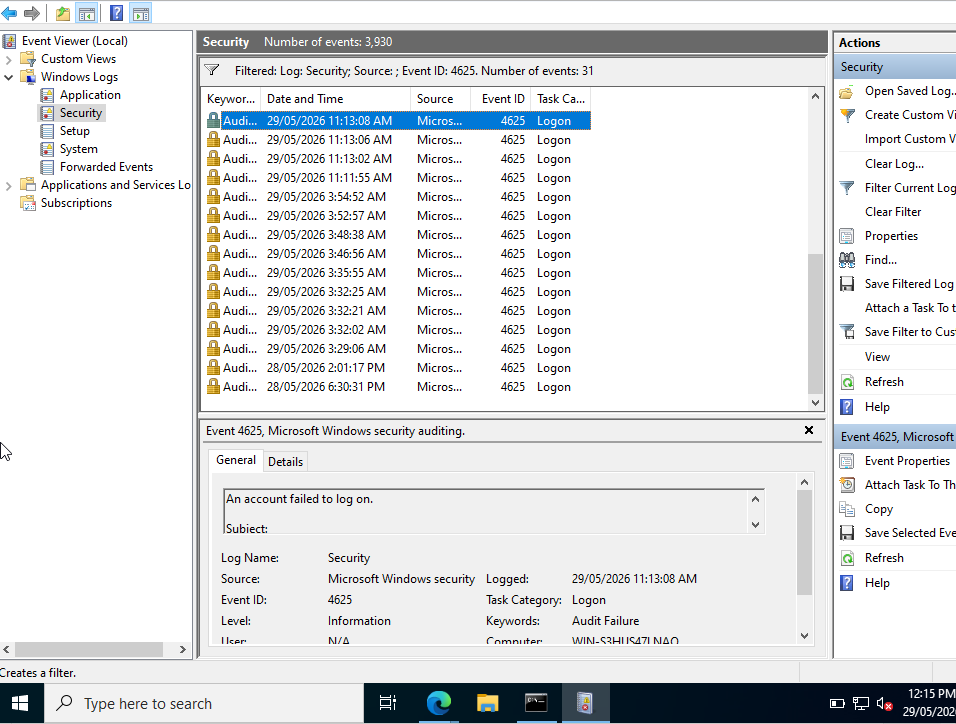
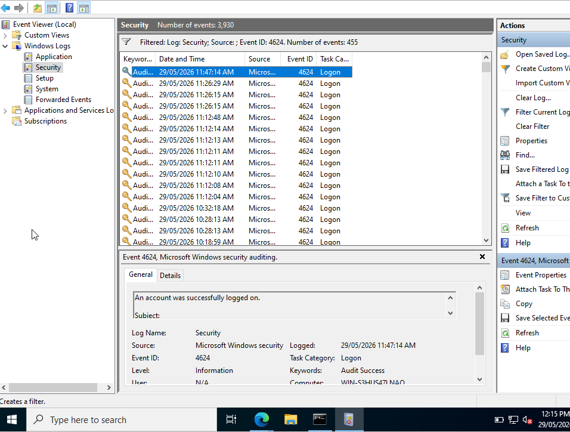

# Azure Sentinel RDP SOC Detection Lab

## Overview

This project is a Security Operations Center (SOC) lab simulating detection and investigation of Remote Desktop Protocol (RDP) brute-force attacks in a Windows environment.

The goal is to demonstrate real-world SOC workflows including log ingestion, detection engineering, and incident investigation using Microsoft Sentinel.

---

## Environment

- Windows Server 2022 (target system with RDP enabled)
- Windows 11 (attacker / admin workstation)
- Microsoft Azure Sentinel (SIEM platform)
- Log Analytics Workspace (log ingestion layer)

---

## Architecture

The lab simulates an enterprise RDP attack surface:

- Windows 11 generates authentication attempts against Windows Server 2022
- Windows Server logs all authentication activity via Windows Security Event Logs
- Logs are forwarded to Azure Log Analytics
- Microsoft Sentinel detects suspicious patterns and generates incidents

---

## Data Sources

### Windows Server 2022
- Security Event Logs
- Event ID 4624 (Successful logon)
- Event ID 4625 (Failed logon)
- Event ID 4688 (Process creation)

### Windows 11
- RDP connection attempts
- Authentication activity during attack simulation

---

## Detection Use Cases

- RDP brute-force detection (multiple 4625 failures in short time)
- Suspicious successful login after repeated failures
- Unusual authentication patterns from single source IP
- Process-based suspicious activity (4688 correlation)

---

## Investigation Workflow

1. Attacker simulation initiated from Windows 11 machine
2. RDP authentication attempts generated against Windows Server 2022
3. Security logs collected on Windows Server
4. Logs forwarded to Log Analytics Workspace
5. Microsoft Sentinel analyzes telemetry and triggers alerts
6. SOC analyst investigates incident timeline and root cause

---

## SIEM Platform

This lab uses:

Microsoft Sentinel (SIEM)  
A cloud-native security information and event management solution used for threat detection, investigation, and response.

---

## Repository Structure

architecture/        -> Architecture diagrams  
detections/          -> KQL detection queries  
incident-reports/    -> SOC investigation reports  
evidence/            -> Screenshots and log exports  
setup-notes/         -> Environment configuration notes  

---

## Key Skills Demonstrated

- SIEM operations using Microsoft Sentinel
- Windows Event Log analysis
- Detection engineering using KQL
- RDP attack simulation and analysis
- SOC incident investigation workflow

---

## Notes

This environment is fully isolated and used strictly for cybersecurity learning and SOC simulation purposes.

All attacks are simulated and controlled.

---

## SOC Investigation Flow

This section documents the end-to-end investigation of a simulated RDP brute-force attack using Windows Event Logs and Log Analytics.

---

### 1. Detection Phase (Log Analytics – KQL Query)

Initial detection was triggered by analyzing repeated failed authentication attempts (Event ID 4625) against the target system.

---

### 2. Attack Pattern Analysis (Time-Based Spike)

Authentication failures were grouped into time bins to identify abnormal spikes consistent with brute-force behavior.

---

### 3. Host-Level Validation (Windows Event Logs)

Windows Security logs confirmed repeated failed RDP logon attempts (Event ID 4625, Logon Type 10).

---

### 4. Successful Authentication Verification (If Applicable)

Where present, successful RDP authentication events were reviewed to determine whether any brute-force attempts resulted in access.

---

## Summary of Findings

- Multiple failed RDP authentication attempts detected (4625)
- Activity consistent with brute-force attack pattern
- No evidence of unauthorized persistence observed in this simulation
- Logs successfully correlated between SIEM and endpoint

---

## SOC Conclusion

The investigation confirmed a brute-force authentication attempt against a Windows Server 2022 system. Detection was achieved through Log Analytics KQL queries and validated using native Windows Security Event Logs.

